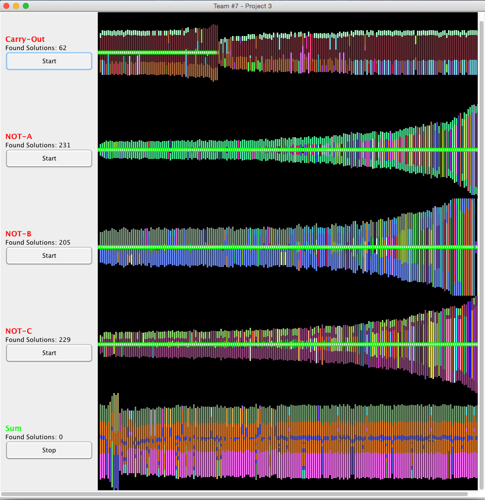

## CSCE-315-Project-3 Genetic Circuit Algorithm

### Notes
For this project I designed the GUI and coded a large portion of the backend. This project consists of two search algorithms for constructing circuits that satisfy a given truth table. The first algorithm utilizes a tree where each node is either an AND, OR, NOT gate. This brute force method attempts to construct a circuit using brute force. While the tree is being constructed a pruning algorithm removes unfit gates to prevent the tree from becoming too dense. Pruning of circuits depends on a calculated fitness score. The second algorithm utilizes a priority queue to order circuits by fitness. Each pass of the algorithm picks two parent circuits and splices them together to create two child circuits. Graphically each circuit is represented by a vertical line. Each pixel in the vertical line represents a different gate which is why each circuit varies in size. As circuits are spliced together they inherit new circuits from parent circuits retaining the color of each parent circuit. 

### Run & Compile
* There are two GUI's, the NonGA and the GA, `project3_NonGA_GUI` and `project3_GA_GUI` respectively.
* If you are running this application on a remote server, you must enable X11 forwarding.
* Checkout this project using Git, `git clone <repo-name>`
* Change directories into project then source folder, `cd <repo-name>`, `cd src/`
* Compile the application, `make`
* Run the application by choosing one of the two GUI's listed above, `java project3_GA_GUI` or `java project3_NonGA_GUI`

### Project Files
There are three important elements of the project: LogicBase, Circuit, and CircuitTree. The following sections discuss our design process of these elements.

#### LogicBase
This class simulates the Logic Gates that are used in the Circuits. All gates are wrapped up into this class for simplification in the Circuit class. Each gate is distinguished by a String: GATE_AND, GATE_OR, GATE_NOT, and GATE_NONE. There can be either one or two inputs (depending on gate), one output, and a Color that is kept so the user can distinguish the origins of the gate. This class also contains an evaluation function which will produce the correct output given all of the inputs for a gate.

#### Circuit
This class is designed using a stack as the container of Logic Gates. It took a good amount of care to make sure that every Logic Gate was accessed in the correct order. There are counters for each type of gate that a Circuit contains because this is where the Fitness is determined. A Circuit's Fitness depends on correctness, number of NOT gates, and the number of AND and OR gates. The NOT gate lead to a much higher Fitness score than other gates because it's ideal to have very few of these gates. There are also useful functions such as Trim, Splice, Load, Save, Evaluate, and ShuffleInputs. The Trim function will traverse the Circuit and determine what gates aren't useful so it can eliminate them. The Splice function splices the top half of one Circuit and the bottom half of another into a child Circuit without altering the two parent Circuits. The Load and Save function will write and read a Circuit from file. Evaluate will call LogicBase's evaluate function for every gate to find the output of the entire Circuit. Finally, the ShuffleInputs randomly generates valid inputs for every Logic Gate.

#### CircuitTree
The CircuitTree class is used to create Circuits that produce the desired outputs. Every Node of the tree has three branches which represent the different Logic Gates that can be added to a Circuit. The Fitness of a Circuit can be determined at every Node of the Tree so the program can decide whether or not it likes that path that it's on. Instead of testing every single combinations of inputs at every node, this implementation saves time by using Circuit's ShuffleInputs function to randomly shuffle the inputs of every Node. This finds the desired Circuit a lot faster in the long run because it's not wasting time changing inputs at every Node.

### Screenshots (project3_GA_GUI)
Compile this version using `make` and run using `java project3_GA_GUI`. Here is a screenshot of our GA algorithm GUI. Each search implementaion runs in its own thread and may be started and stopped independently. Each implemtation is populated with 1000 random circuits (each verified for a solution). The GUI updates every 250ms with resreshed stats on the current running proccesses and graphically shows circuits as they are spliced. All discovered circuit solutions are stored in a unique file in the `src/solutions` directory. The Sum circuit may take some time to find. The pool size never exceeds 1000 circuits and is allways filtered for the best circuits according to fitness.

#### Pre-Run

#### Post-Run
All circuits with green and white boxes in the center are complete solution circuits. 

### Screenshot (project3_NonGA_GUI)
Compile this version using `make` and run using `java project3_NonGA_GUI`. Here is a screenshot of our search algorithm GUI. Each search implementaion runs in its own thread and may be started and stopped independently. The GUI updates every 250ms with resreshed stats on the current running proccesses. All discovered circuit solutions are stored in a unique file in the `src/solutions` directory. The Sum circuit may take some time to find.

### The Team
* Rafa Moreno - [@ralphie9224](https://github.com/ralphie9224)
* Robert (Bob) Timm
* Ben Whitley

### License
Copyright (c) 2015 Robert Timm, Rafa Moreno, Ben Whitley

Permission is hereby granted, free of charge, to any person obtaining a copy of this software and associated documentation files (the "Software"), to deal in the Software without restriction, including without limitation the rights to use, copy, modify, merge, publish, distribute, sublicense, and/or sell copies of the Software, and to permit persons to whom the Software is furnished to do so, subject to the following conditions:

The above copyright notice and this permission notice shall be included in all copies or substantial portions of the Software.

THE SOFTWARE IS PROVIDED "AS IS", WITHOUT WARRANTY OF ANY KIND, EXPRESS OR IMPLIED, INCLUDING BUT NOT LIMITED TO THE WARRANTIES OF MERCHANTABILITY, FITNESS FOR A PARTICULAR PURPOSE AND NONINFRINGEMENT. IN NO EVENT SHALL THE AUTHORS OR COPYRIGHT HOLDERS BE LIABLE FOR ANY CLAIM, DAMAGES OR OTHER LIABILITY, WHETHER IN AN ACTION OF CONTRACT, TORT OR OTHERWISE, ARISING FROM, OUT OF OR IN CONNECTION WITH THE SOFTWARE OR THE USE OR OTHER DEALINGS IN THE SOFTWARE.

